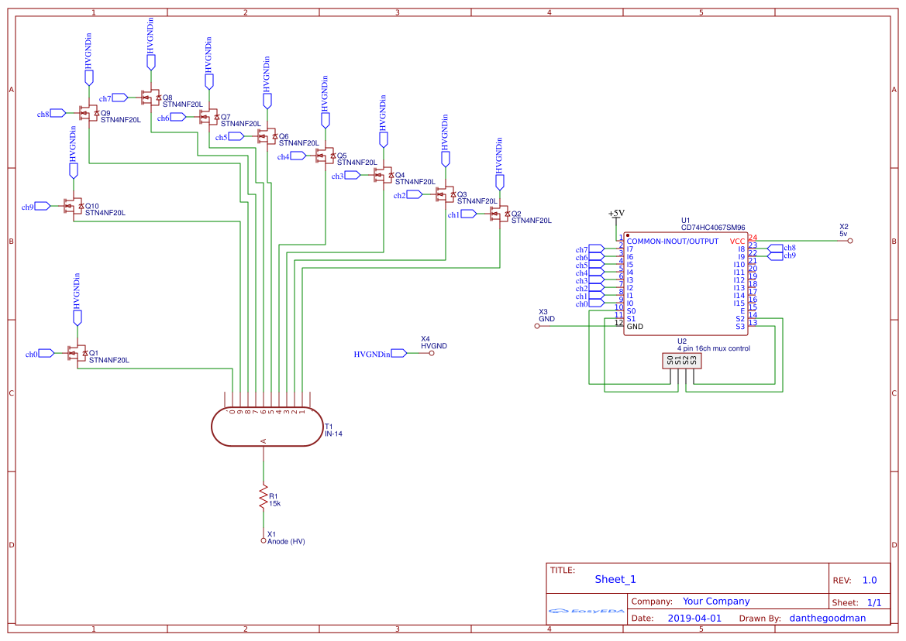
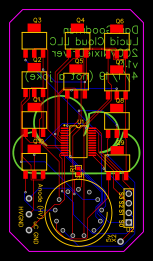

# IN-14 200v Tube Driver Board

## Purpose

So looking at the design of Nixie Driver chips like the `K155ID1` and the `KM155ID1`, I decided that it might be cool to design my own board that acts similarly to these chips. These chips are basically 16-Channel Multiplexers that have high voltage transistors in them, and are Muxes for GND. So all I had to do to make my own board was create the same effect with different components.

So I knew I would need at least a 16-Channel Mux for this project. I chose the `CD74HC4067` chip, as I have used it before and it's cheap. I also knew I would need MOSFETs that could handle at least 170v, so I chose the `STN4NF20L` as it had the small form factor I wanted, as well as the 200v rating that I needed.

The Mux would control which of the 10 MOSFETs was currently grounded (I chose to ignore the left and right comma cathodes for v1.0 for simplicity) by one of the 4 select pins controlled by a microcontroller.

## Versions

### v1.0:

**Schematic:**

**PCB:**

**Changelog:**
- Initial design
- 10 channels active (ignoring commas)
