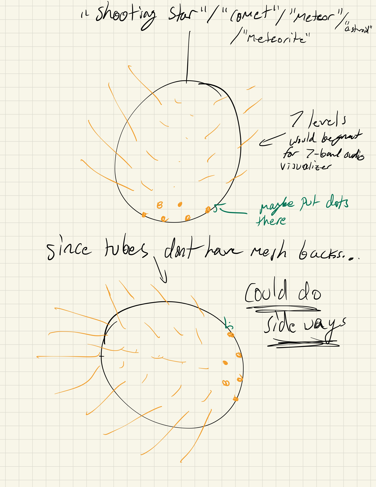
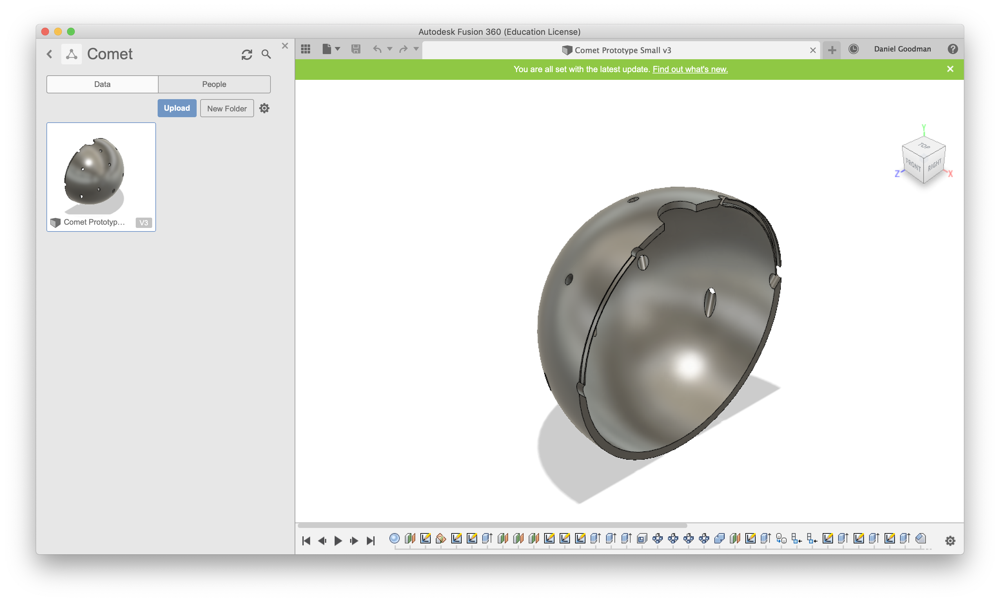

# Comet Chandelier

Time to build something cool.

Originally called "Starburst", then changed to a myriad of names you can see listed, I made a terrible initial drawing concept:

It was initially called starburst because I wanted it to look like it was exploding, but found out that the bargraph was only visible from one half of the tube, so I had to angle them up so you wouldn't ever be looking at the back of a tube.

I had my friend Anthony help me design a 3D model for the ball. The problem was printing or getting it manufactured was going to be insane for a prototype, so my dad helped my find [this giant dog toy](https://www.indestructibledog.com/products/dogify-indestructible-ball?variant=249773542) that was big, hollow, and rigid that I could use as the body. I will be spray painting it so it doesn't look idiotic with it's stock color.

It has all holes angled up, and is split in half with notches so I can easily work on the electronic internals then put it perfectly back together.
