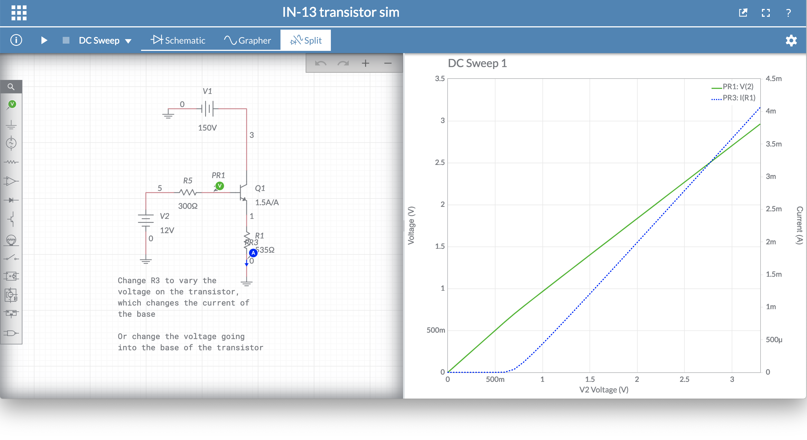

# Learning to use the IN-13 tube

IN-13 bargraph Nixie tubes work by powering the anode with 150v DC, grounding the AUX cathode (with a resistor!), and modulating the current running through the indicating cathode to determine how much of the bargraph is illuminated.

So following part of [this example from SMBaker](http://smbaker.com/experimenting-with-in-13-bargraph-nixie-tubes) (took me a bit to realize that R2 was a pre-set resistor/pot), I started running simulations on a virtual transistor to check current control using the MJE340 transistor:

I am sure this will be quite different with actual hardware and using a IN-13 tube, but I wanted to see at what values I get the max current (4.6mA) for the tube at 150v, using 0-3.3v to control the transistor (V2 is labeled at 12v, but it was simulated from 0-3.3v).

I knew for one of my projects I would want to use these tubes for Audio Spectrum Analysis. For that I would need to analyze audio frequencies and map them to amplitudes.

From previous attempts, I knew I would probably have to use a FFT to accomplish this. Fortunately I found the awesome MSGEQ7 chip that would handle 7 bands of audio analysis, good enough for me. So I bought [this dfrobot module](https://www.dfrobot.com/product-514.html) and 2 generic electret mics from Amazon, and got constant output.

Using the scope on my Digilent Electronics Explorer board, I could see that the mics were actually doing what they should, and the module wasn't doing it's job. So I decided to order two of their corresponding [Analog Sound Sensors](https://www.dfrobot.com/product-83.html) as per their usage examples, and got to work on using FFT directly with the microphones while I waited to see if that solution would work. I used modified code from a different video but [this seems to use the same code](https://www.youtube.com/watch?v=djGOOL2mqV8), and modified it for use with an UNO without a OLED suplay saw slow but working results of a 60-band analyzer.
