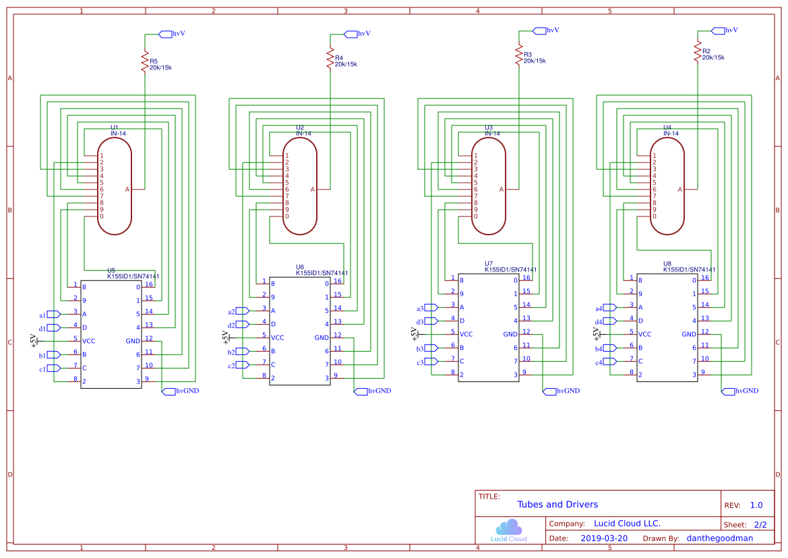
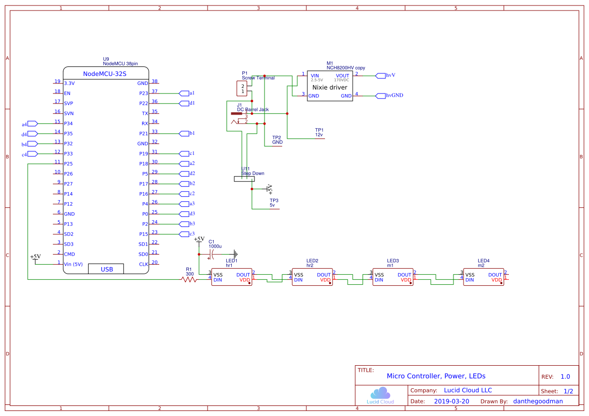
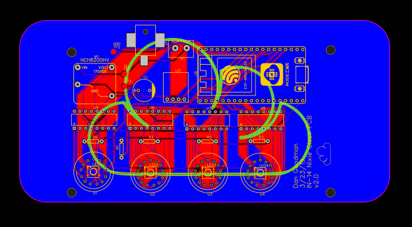

# IN-14 Nixie Tube Clock Project

## Table of Contents
- [Versions](#Versions)
    -[Acrylic Emulation](acrylic)
- [Notes](#Notes)
- Gerber Files:
    - [v1.0](pcbV1.0)
    - [v2.0](pcbV2.0)

## Purpose

Nixie Tubes are beautiful, no way around it. When I got my first IN-14 tube, I was surprised at how small it was, but I'll upgrade to IN-18 or [These amazing z568m tubes by Dalibor Farny](https://daliborfarny.com/product/rz568m-nixie-tube/) at some point. I really want to get my hands on some F9020AA tubes, but I can't seem to find any.

The clock was a good intro to Nixie tube usage and logic. Using an ESP32 to control the logic for the K155ID1 Nixie drivers ([great resource here](https://archive.fo/euOg7)), NCH6100HV for the power supply, some WS2812b LEDs for under-lighting of the tubes, and some other components to regulate current and change voltages was a goal.

I first designed a circuit and logic that would read the time from a i2c RTC module. Once that was working, I got indexing through a single IN-14 tube running from an UNO, then a WEMOS D1 Mini:

_In the background of this gif you can see the exploded capacitor on the yellow power supply. That ZVS capacitor charging supply exploded while I was working on it and may have damaged a 6e5 tube I was using. DO NOT USE THEM THEY ARE INCONSISTENT WITH THEIR OUTPUT SOMETIMES YOU PLUG IT IN AND IT GOES TO LIKE 600V!_

For some reason lighting the 7 started flickering 8. I don't believe it did this initially when I switched over from the UNO to the D1 mini, so I think it might be either the tube or the driver... We'll see when I start putting together the v1.0 PCB when it arrives.

I am also working on the [acrylic emulation](acrylic) in parallel with this project, although it is getting a lot less attention then the real tubes.

## Notes

**3/25/19**
Unfortunately, for the v1.0 PCB I forgot to do copper pours for the top and bottom layer. No big deal, it should still work (but we'll see when it comes). I designed a second version of the PCB using the NCH8200HV which is much smaller and has a fixed 170v output, which is what I was using anyway. Designed it with through-hole components so I didn't have to order more parts, and for the tube resistors I will use 20k in order to extend tube life, even though I could use 15k or even 10k. This is really a first prototype after all.

**4/4/19**
Finally got around to soldering it, and spent a whole lot fo time debugging. First off, the power supply that was reliable from China didn't work (got stuck at 263v, max rated for 235v and couldn't adjust), so I had to use another one temporarily by soldering it externally to the board. Then I realized I had the IC drivers in backwards (busted 2 of them pulling them out, oops). Then I thought the board was broken, and after desoldering a bunch of stuff realized that the power supply was the problem as I mentioned before. Finally I thought the ICs were busted, but after a bunch of testing, I realized I never merged the ground between the ESP32 and the 12v, 5v GND net... Holding a jumper wire from the GND on the ESP32 to the GND net test pads shows that it lets the one tube that I gave an IC for index through the numbers:

**4/7/19**
After getting all of the ICs in place to test, I realize 2 things. The first being that the largest digit tube is stuck on 2 or off depending on what is written, (the IC is fine, and after testing continuity of the select pins and the grounding pins the PCB is fine too, so it must be the tube). Second, the PCB footprint seems to account for the tubes being upside down, as it starts at 1, then goes to 0, then counts down from 9 instead of just counting up starting a 0. This is unfortunate as I have already ordered the v2.0 PCB (I can just put the tubes in upside down and mount the feet on the other side, shouldn't be a problem since I probably wont put the tall capacitor in for the LEDs).

**4/9/19**
So the tube actually works, I cannot figure out why the IC, PCB, and tube together didn't work because they all do fine individually.

## Versions

### v1.0:
**Changelog:**
- Initial design
- NCH6100HV power supply (set at 170v)
- ESP32 (38pin NodeMCU) for control
- 12v power supply
- 12v to 5v step down (in fixed mode) to power ESP32, Nixie ICs

### v2.0

**Schematic:**

**PCB:**

**Changelog:**
- Smaller design
    - Changed NCH6100HV to NCH8200HV for fixed output voltage and smaller size
- Actually did copper pours this time
- Text is Silk Screen instead of copper (lol I am a pro)
- Actually faced tubes in right direction (man I really sped through this design)
- Fixed grounding issue from 4/4/19 log
- Added DS1307 RTC module
- Decided to keep not using copper pour

### v2.1
**Changelog:**
- Fixed tubes so they are upright
- Added in separator colon (and praying my voltage divider only divides where I want it to)
- Added 90v voltage divider and test point
- Increased width of power traces
